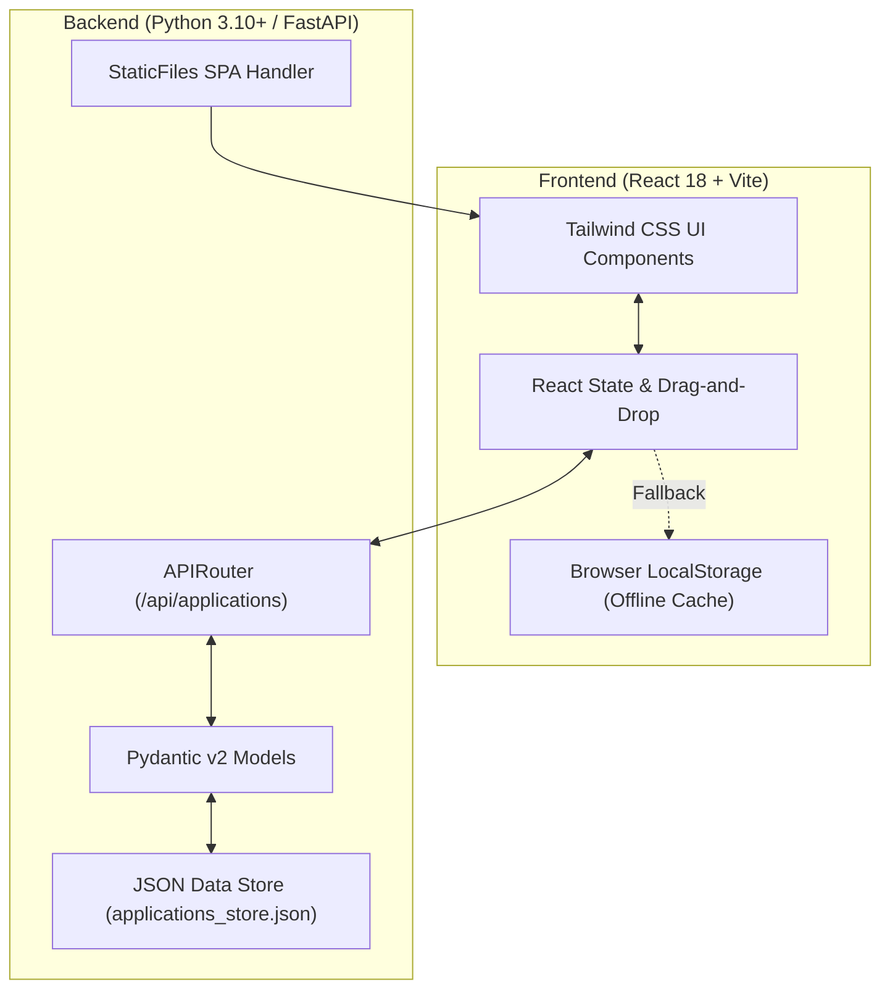

# Job Application Tracker

A high-performance, full-stack application tracking system built with **React 18, Vite, Tailwind CSS, and FastAPI**. Designed to track college placement drives and off-campus recruitment workflows with sequential stage progression, status transitions, interview dates, preparation checklists, and document attachments.

[](https://fastapi.tiangolo.com)
[](https://react.dev)
[](https://tailwindcss.com)
[](https://vitejs.dev)
[](https://opensource.org/licenses/MIT)

---

## 🌟 Key Features

### 1. Sequential Round-by-Round Trackdown
- **Visual Progress Pipeline**: Clear multi-stage pipeline:
  $$\text{Online Assessment (OA)} \longrightarrow \text{Technical Interview 1} \longrightarrow \text{Technical Interview 2} \longrightarrow \text{HR Interview} \longrightarrow \text{Offer Received}$$
- **Green Tick (`✓`)**: Marks a stage as cleared or advances the candidate to the next round.
- **Red Cross (`✕`)**: Marks rejection at a specific stage with visual status indicators.
- **Uncommenced Stages**: Cleanly greyed out without distracting animations.
- **Date & Time Tagging**: Schedule specific dates & times for every round (e.g. `26 Sep, 7:00 PM`) with 1-click inline editing.
- **Stage Customization**: Add new stages, rename stages inline, or drag-and-drop to reorder rounds per opportunity.

### 2. Status Transition Engine & Dedicated Section Views
- **In Progress (Default Home View)**: Displays only active, ongoing job opportunities so you stay focused on immediate deadlines.
- **Shortlisted / Offers**: Marking "Offer Received" as cleared (`✓`) triggers a smooth transition animation and moves the company card to the **Shortlisted / Offers** section.
- **Rejected Section**: Marking any round with Red Cross (`✕`) animates the card into the **Rejected** section.
- **Navigation Tabs**: Quick-switch buttons with live count badges for:
  - ⏳ **In Progress**
  - 🏆 **Shortlisted / Offers**
  - ❌ **Rejected**
  - 🏢 **All Applications**
- **Action Toast Alerts**: Interactive toasts notify you whenever a company moves sections, with a 1-click "View" shortcut.

### 3. Required Topic Knowledge Matrix
- Topic checklist embedded in each opportunity card (e.g., DSA, Operating Systems, System Design, OOP/C++, DBMS + SQL, Computer Networks).
- Check off prepared topics with instant green indicators.
- Customize topics per opportunity in the Opportunity Edit Modal with quick suggestions or custom entries.

### 4. Attached Documents (Resume & Job Descriptions)
- Attach applied custom resume PDFs and company Job Description (JD) files directly to each card.
- 1-click inline preview and download capabilities.
- Supports PDF, DOC, DOCX, TXT, and image files.

### 5. Drag-and-Drop Card Prioritization
- Reorder opportunity cards directly in the grid using native HTML5 Drag and Drop.
- Reorder state is automatically synced with the backend and local storage.

### 6. Clean Fresh Start & Sample Templates
- **Starts Fresh**: Deploys in a clean empty state with 0 applications so users can immediately start entering their own job pipeline.
- **Sample Template Loader**: Includes an optional 1-click button to load rich pre-configured sample applications to explore all features.

---

## 🏗️ Architecture & Tech Stack



### Technology Breakdown

| Layer | Technologies | Description |
| :--- | :--- | :--- |
| **Frontend** | React 18, Vite 6 | Fast modern component-driven SPA |
| **Styling** | Tailwind CSS v3, Plus Jakarta Sans | Utility-first responsive design system |
| **Icons** | Lucide React | Feather-based clean iconography |
| **Backend** | FastAPI, Uvicorn | High-throughput asynchronous ASGI Python framework |
| **Validation** | Pydantic v2 | Strict schema validation for applications, stages & topics |
| **Persistence** | File-backed JSON + LocalStorage | Instant dual-layer persistence with offline capability |
| **Deployment** | Vercel, Render, Railway, Docker | Single-command deployment support |

---

## 📂 Project Structure

```
Job-Application-Tracker/
├── backend/
│   ├── main.py                     # FastAPI entrypoint & SPA static file server
│   ├── requirements.txt            # Python dependencies (fastapi, uvicorn, pydantic)
│   ├── applications_store.json     # JSON persistent store (starts empty)
│   ├── models/
│   │   └── application.py          # Pydantic schemas (Application, Stage, Topic, Attachment)
│   └── routes/
│       └── applications.py         # Full RESTful CRUD, reordering & sample endpoints
├── frontend/
│   ├── index.html                  # HTML5 entrypoint with Google Fonts
│   ├── package.json                # Dependencies & Vite build scripts
│   ├── vite.config.js              # Vite configuration with proxy to port 8000
│   ├── vercel.json                 # Vercel deployment rewrite rules
│   └── src/
│       ├── main.jsx                # React DOM entrypoint
│       ├── App.jsx                 # Core orchestrator, section routing, filtering
│       ├── api.js                  # API client with automatic LocalStorage fallback
│       ├── index.css               # Tailwind CSS directives & custom scrollbars
│       ├── components/
│       │   ├── Navbar.jsx          # Header branding, search input, type filters
│       │   ├── StatsBar.jsx        # Interactive section buttons & schedule card
│       │   ├── ApplicationCard.jsx # Opportunity card with controls & transitions
│       │   ├── DeliveryStepper.jsx # Sequential progress stepper with dates & checkmarks
│       │   ├── TopicKnowledgeSection.jsx # Preparation checklist matrix
│       │   ├── FileAttachmentSection.jsx  # Resume & JD upload/preview controls
│       │   └── ApplicationModal.jsx       # Modal for creating & editing opportunities
│       └── constants/
│           └── topics.js           # Topic presets and default stage templates
├── Procfile                        # Heroku / Railway / Render web service definition
├── render.yaml                     # Render.com blueprint configuration
├── vercel.json                     # Root Vercel deployment configuration
├── .gitignore                      # Git exclusion rules
└── README.md                       # Complete documentation
```

---

## ⚡ Quick Start (Local Development)

### Prerequisites
- **Node.js**: v18+ ([Download](https://nodejs.org/))
- **Python**: v3.10+ ([Download](https://www.python.org/))

### 1. Clone the Repository
```bash
git clone https://github.com/vikaskolanu/Job-Application-Tracker.git
cd Job-Application-Tracker
```

### 2. Run the Unified Backend (API + Static Frontend)
```bash
# 1. Install frontend dependencies & build
cd frontend
npm install
npm run build
cd ..

# 2. Install backend dependencies & start
cd backend
pip install -r requirements.txt
python -m uvicorn main:app --host 0.0.0.0 --port 8000 --reload
```
Open **[http://localhost:8000](http://localhost:8000)** in your browser.

### 3. Alternatively: Run with Hot-Reloading (Dev Mode)
To develop with instant hot-module replacement (HMR):

**Terminal 1 (Backend API):**
```bash
cd backend
pip install -r requirements.txt
python -m uvicorn main:app --host 0.0.0.0 --port 8000 --reload
```

**Terminal 2 (Frontend Dev Server):**
```bash
cd frontend
npm install
npm run dev
```
Open **[http://localhost:5173](http://localhost:5173)** in your browser (API requests automatically proxy to `:8000`).

---

## 🔌 REST API Reference

| Method | Endpoint | Description |
| :--- | :--- | :--- |
| `GET` | `/api/applications` | List applications (supports `?search=`, `?type=`, `?status=`) |
| `POST` | `/api/applications` | Create a new job application |
| `GET` | `/api/applications/{id}` | Get application details by ID |
| `PUT` | `/api/applications/{id}` | Update application details, stages, topics, or attachments |
| `DELETE` | `/api/applications/{id}` | Delete an application |
| `PUT` | `/api/applications/reorder/all` | Reorder applications by ID list |
| `POST` | `/api/applications/reset/seed` | Reset tracker to empty state |
| `POST` | `/api/applications/load/sample` | Load pre-configured sample templates |

### Sample Application Data Schema
```json
{
  "id": "app-1727170000000",
  "company": "Google",
  "role": "Software Engineer",
  "type": "Off-Campus",
  "compensation": "30 LPA",
  "duration": "Full Time",
  "location": "Bengaluru / Hyderabad",
  "appliedDate": "2026-09-24",
  "status": "active",
  "order": 0,
  "stages": [
    {
      "id": "st-1",
      "name": "Online Assessment (OA)",
      "date": "2026-10-05 18:00",
      "status": "completed",
      "notes": "Cleared 2 coding questions"
    },
    {
      "id": "st-2",
      "name": "Technical Interview 1",
      "date": "2026-10-12 14:00",
      "status": "pending",
      "notes": "Data structures & algorithms"
    },
    {
      "id": "st-3",
      "name": "Offer Received",
      "date": "",
      "status": "pending",
      "notes": "Final offer letter"
    }
  ],
  "topics": [
    { "id": "t-1", "name": "DSA", "selected": true },
    { "id": "t-2", "name": "System Design", "selected": false },
    { "id": "t-3", "name": "Operating System", "selected": true }
  ],
  "attachments": []
}
```

---


---

## 📄 License
This project is licensed under the MIT License - see the [LICENSE](LICENSE) file for details.
